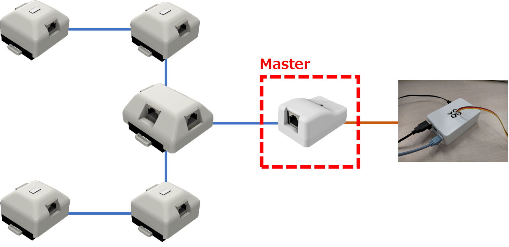

# 1.概要

Grid-EYEシステムは、ラズパイをセンサ端末とし、各モジュールを組み合わせて接続することでシステムを構成している。

各モジュールは、Masterモジュールを介しラズパイと接続している。

MasterモジュールはラズパイのGPIOピンに直接に接続しており、そのままでは、GPIOピンのない一般的なPCをセンサ端末とすることはできない。

- システム構成

  

USB-Masterモジュールは、GPIOピンによるインタフェースをUSBに置き替えたモジュールであるため、PCをセンサ端末にすることが可能になる。

- システム構成（USB Masterモジュール使用）

